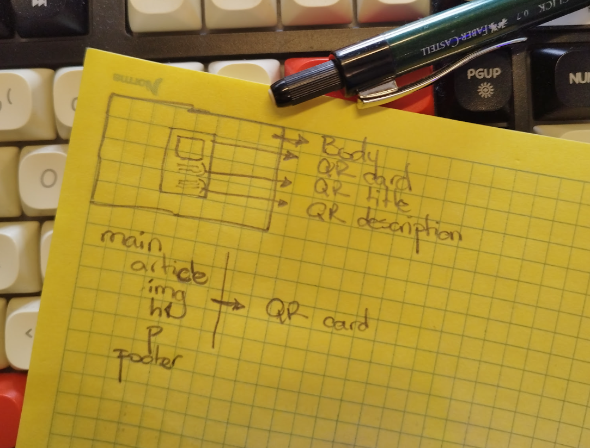
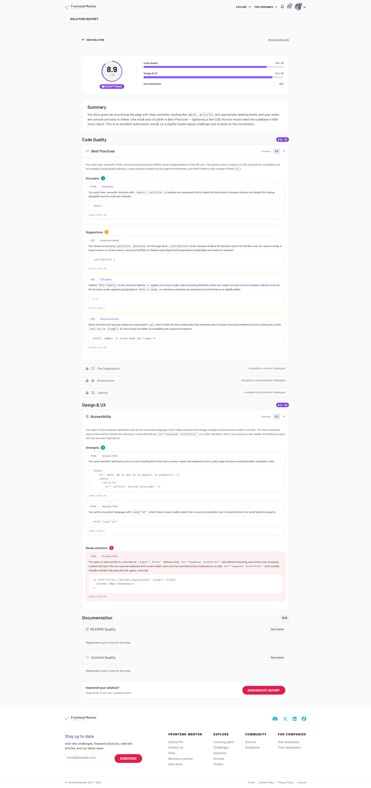
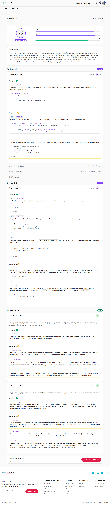

# Frontend Mentor - QR code component solution

This is a solution to the [QR code component challenge on Frontend Mentor](https://www.frontendmentor.io/challenges/qr-code-component-iux_sIO_H). Frontend Mentor challenges help you improve your coding skills by building realistic projects.

## Table of contents

- [Overview](#overview)
- [Project Evolution & Grading Context](#project-evolution--grading-context)
  - [Why the Score Changed](#why-the-score-changed)
  - [How I Improved](#how-i-improved)

  - [Links](#links)

- [My process](#my-process)
  - [Built with](#built-with)
  - [What I learned](#what-i-learned)
  - [Continued development](#continued-development)
  - [Useful resources (AI Collaboration)](#useful-resources-ai-collaboration)
- [Author](#author)

## Overview

This is my solution to the QR Code Component challenge on Frontend Mentor.

The goal of this project was to build a clean, responsive layout that matches the provided design perfectly. While working on this challenge, my main focus was moving away from random design choices and learning how to use a strict, organized CSS Design System instead.

I built this project with a mobile-first approach, ensuring that the layout looks professional and scales correctly on screens of any size.



## Project Evolution & Grading Context

This was my very first frontend project. Over three weeks, my focus shifted from just making the code work to learning professional workflows. Here is why my score went from **8.9** to **8.8**:

### Why the Score Changed

- **First Review (8.9/10):** The automated system only checked my code. It did not look at my documentation or commit history.
- **Second Review (8.8/10):** The system updated its criteria to evaluate documentation. Three weeks ago, my only goal was learning HTML and CSS. Clean commits and detailed READMEs were not my priority yet.



### How I Improved

I did not see the 8.8 score as a downgrade, but as a roadmap to grow. I immediately updated the project to meet these higher standards:

1. **Clearer README:** I added a simple summary so beginner developers can easily follow my notes.
2. **Better Commits:** I switched to a professional git workflow using Conventional Commits (like `fix(readme): :memo:`).

This small change in my score reflects a stricter test that actually helped me become a better developer.



### Links

- Solution URL: [GitHub Repository](https://github.com/ezra1492/frontend-mentor-qr-code)
- Live Site URL: [GitHub Pages Deployment](https://ezra1492.github.io/frontend-mentor-qr-code/)

## My process

### Built with

- Semantic HTML5 markup
- CSS3 Custom Properties (Design Token Vault)
- Flexbox Architecture
- Mobile-first workflow
- Strict Atomic Scale & Primitive Tokenization

### What I learned

> 💡 **Quick Takeaways:**
>
> - **Centering the Card:** I learned how to use Flexbox to perfectly center the entire card right in the middle of the screen, both vertically and horizontally.
> - **Fixing Image Spacing:** I fixed a common bug where images leave an annoying gap at the bottom by changing the image display behavior to block.
> - **What I Struggled With:** I struggled with moving away from quick, random spacing numbers. Instead, I forced myself to use a strict system of pre-made CSS variables to keep the spacing uniform.

---

During this project, I focused on moving away from random values and learned how to use a structured Design System. I also spent time understanding how web browsers calculate layouts and spacing.

Here are the most important things I learned:

1. **How Flexbox Axes Rotate:** I learned that when you change `flex-direction` to `column`, the main axis and the cross axis swap places completely.

```css
/* FLEXBOX CENTERING + INHERITABLE FONT */
body {
  display: flex; /* Activate Flexbox context*/
  flex-direction: column; /* Main axis is now vertical, cross axis is horizontal*/
  align-items: center; /* CROSS AXIS (Horizontal): Takes the viewport width and centers the content horizontally */
  justify-content: center; /* MAIN AXIS (Vertical): Distributes the remaining vertical space between the article and footer */
  min-height: 100vh; /* Force body to take at least 100% of the viewport height */
  font-family: var(--ff-site);
  background-color: var(--clr-slate300);
}
```

2. **Fixing the Image Spacing Bug:** I learned why images sometimes have a small, unwanted gap underneath them. By changing the image to `display: block`, I completely removed that extra whitespace.

```css
/* QR CODE IMAGE */
.qr-code__img {
  display: block; /* Eliminates the default inline baseline whitespace. The image perfectly respects the article's padding */
  width: 100%; /* Spans the full available width, preventing container overflow */
  height: auto; /* Maintains the original aspect ratio to prevent image distortion */
  border-radius: var(--br-s);
}
```

3. **Replacing Hardcoded Numbers:** I successfully replaced random spacing numbers with clean, reusable layout variables like `var(--sp-300)` to keep my design uniform.

```css
/* QR CODE CARD */
.qr-code {
  width: var(--width-qr-card);
  padding: var(
    --padding-qr-card
  ); /* Inner spacing: 16px top/left/right, and 40px bottom */
  border-radius: var(--br-l);
  box-shadow: var(
    --bs-qr-card
  ); /* Horizontal axis 0px, vertical 24px, blur 24px, spread 0px, and rgba black with 4.77% opacity */
  background-color: var(--clr-white);
}
```

### Continued development

- **Systematic Architecture:** I plan to continue enforcing strict Design Token structures from the very beginning of my upcoming layouts.
- **Git Mastery:** Transitioning towards more modular and atomic commit habits using professional standards.

### Useful Resources (AI Collaboration)

- **[Gitmoji](https://gitmoji.dev)**: This website helped me learn how to make small, clean commits. Using emojis made it much easier to track my changes visually.
- **Gemini (NotebookLM-style workflows)**: I used this AI tool to check my code structure, translate my notes into clear English, and keep my workspace organized.

**What I achieved using these tools:**

- I had fewer issues when pushing code from my computer to GitHub.
- I learned how to use advanced concepts like Design Tokens much faster.
- I built a smoother, faster workflow for my daily coding tasks.

## Author

- Frontend Mentor - [@ezra1492](https://github.com/ezra1492)
- X / Twitter - [@RayG1492](https://x.com/RayG1492)
- Discord - `rayg._86220`
